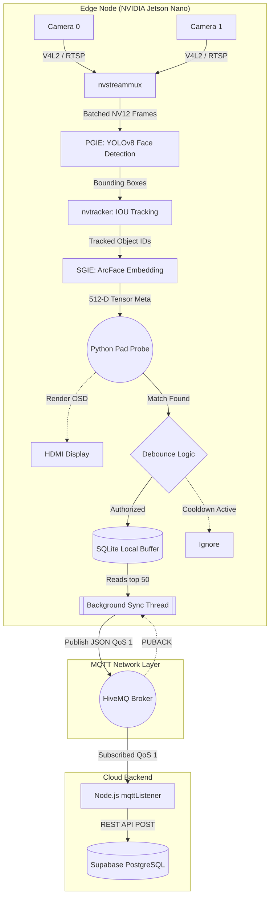
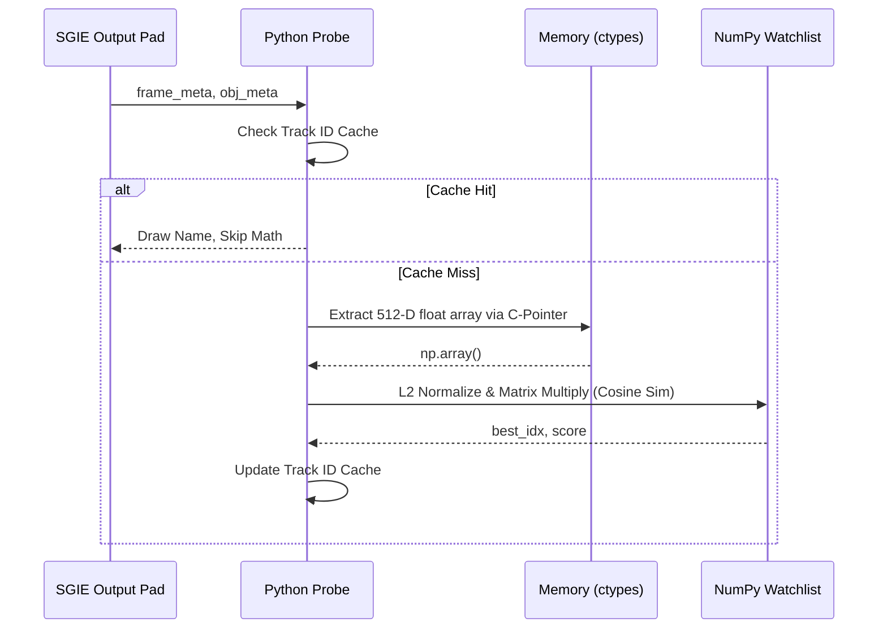
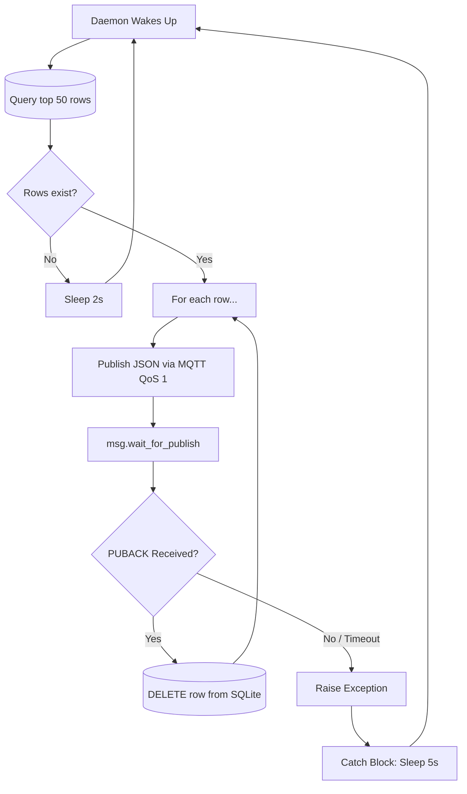

# 🧠 System Architecture Deep Dive
**Real-Time Edge-to-Cloud Facial Recognition Pipeline**

This document provides a highly detailed, engineering-level breakdown of the edge-to-cloud computer vision architecture. It traces the lifecycle of a video frame from photon capture at the camera lens to a persistent attendance record stored in a cloud PostgreSQL database.

---

## 1. High-Level System Architecture

The system is fundamentally divided into two physical locations: the **Edge Node** (NVIDIA Jetson Nano) running a C/C++ accelerated GStreamer pipeline wrapped in Python, and the **Cloud Backend** running Node.js and Supabase. They communicate asynchronously via an MQTT Broker.



---

## 2. The DeepStream (NVGIE) & GStreamer Pipeline

The computer vision pipeline is built using NVIDIA's DeepStream SDK, which sits on top of GStreamer. Its primary goal is to keep image data inside **NVMM (NVIDIA Memory Management)**, meaning the GPU processes the frames directly without expensive memory copies back and forth to the CPU.

### 2.1 Source Acquisition & Memory Pinning
- **`v4l2src` / `uridecodebin`**: These elements acquire the raw video streams. `v4l2src` handles direct USB hardware connections, while `uridecodebin` handles network streams (RTSP/HTTP).
- **`nvvideoconvert`**: This is a critical hardware-accelerated element. It takes raw CPU pixel buffers and moves them into NVMM (GPU memory). 
- **`capsfilter`**: Enforces a strict `NV12` color format and resolution scaling (e.g., 960x540). Scaling down before the neural networks significantly reduces memory bandwidth pressure on the Jetson Nano.

### 2.2 Batching (`nvstreammux`)
DeepStream is designed for multi-stream throughput. 
- The multiplexer collects frames from all configured camera sources and combines them into a single 4D tensor (Batch). 
- If `batch-size=2`, the GPU executes the YOLOv8 neural network once, analyzing two frames simultaneously in parallel.
- `batched-push-timeout=40000`: If one camera lags and doesn't provide a frame within 40ms, the muxer pushes a partially filled batch to prevent pipeline starvation.

### 2.3 Primary Inference (PGIE) - YOLOv8
- **Inference Engine**: Runs `nvinfer` configured with a TensorRT-optimized YOLOv8 engine in FP16 precision.
- **Custom Parsing**: YOLOv8 outputs raw tensors. We use a compiled C++ custom parser (`libnvds_infercustomparser_yolov8.so`) to decode the YOLO grid outputs into standard `NvDsBbox` objects.
- **NMS (Non-Maximum Suppression)**: DeepStream applies clustering (usually DBSCAN or NMS) to merge overlapping bounding boxes of the same face.

### 2.4 Object Tracking (`nvtracker`)
The tracker assigns a persistent, unique integer ID (e.g., `Object ID 45`) to a bounding box across consecutive frames using the IOU (Intersection Over Union) algorithm.
- **Why it matters**: Without tracking, the system treats a person standing still for 30 frames as 30 completely different people, forcing the embedding model to run 30 times. With tracking, we know it's the exact same entity.

### 2.5 Secondary Inference (SGIE) - ArcFace / MobileFaceNet
- **Cropping & Padding**: The SGIE operates *only* on the bounding boxes provided by the PGIE. It crops the face, resizes it, and applies symmetric padding to maintain the aspect ratio (preventing stretched faces which ruin recognition accuracy).
- **Tensor Output**: Instead of outputting a classification label, we configure `network-type=100` and `output-tensor-meta=1`. This tells DeepStream to attach the raw 512-dimensional output vector (the facial fingerprint) to the GStreamer object metadata.

---

## 3. The Python Interception Probe & AI Logic

To interact with the DeepStream pipeline using Python, we attach a **Pad Probe** to the Source Pad of the SGIE element. This function blocks the pipeline momentarily to let Python inspect the metadata of the frame before it proceeds to the screen.



### 3.1 C-Types Memory Extraction
DeepStream metadata is written in C. To read the 512-D tensor in Python, we extract the raw memory pointer:
```python
ptr = ctypes.cast(pyds.get_ptr(layer.buffer), ctypes.POINTER(ctypes.c_float))
live_embedding = np.copy(np.ctypeslib.as_array(ptr, shape=(512,)))
```
*Note: `np.copy()` is mandatory here. If we don't copy it, the GPU will overwrite that memory address on the next frame cycle, corrupting our Python variable.*

### 3.2 Vectorized Cosine Similarity
We load all enrolled student faces into a single highly optimized NumPy matrix `(N, 512)` at startup. 
To match a face, we compute the dot product of the live vector against the entire matrix simultaneously:
```python
scores = watchlist_matrix @ query_vector
best_idx = np.argmax(scores)
```
This reduces face matching to an **O(1)** operation. Whether you have 10 students or 10,000 students, the match time remains essentially instantaneous.

### 3.3 The Tracker Cache Optimization
Once we match `Object ID 45` to "Student A", we store it in a Python dictionary. For all subsequent frames where `Object ID 45` is present, we completely bypass the C-pointer extraction and matrix math. This is the primary reason the system can maintain 30+ FPS on a low-power Jetson Nano.

---

## 4. Edge State Management & Debounce Logic

Once the computer vision loop identifies a student, we must persist the event. However, a camera running at 30 FPS will detect the same face 300 times in 10 seconds. 

### 4.1 Debounce Cooldown
We implement a `last_seen` dictionary in memory. 
```python
if time.time() - last_seen[student_id] < COOLDOWN_SECONDS:
    pass # Ignore
else:
    save_to_buffer()
```
By setting `COOLDOWN_SECONDS = 300` (5 minutes), we ensure that a student walking through the gate is only logged exactly once per crossing.

### 4.2 SQLite Durable Buffering
Authorized events are written to `attendance_buffer.db`.
- **Thread Safety**: SQLite handles file locking automatically.
- **Durability**: By buffering locally, the system is highly resilient. If the Jetson Nano is deployed in a location with unstable Wi-Fi, the SQLite database acts as a localized holding tank.

---

## 5. MQTT Synchronization & Resiliency

To prevent network operations (like DNS resolution or TCP handshakes) from blocking the main video thread, the SQLite-to-Cloud synchronization is delegated to a Python `threading.Thread`.



### 5.1 QoS 1 Delivery Guarantee
The daemon uses **Quality of Service (QoS) 1**. 
When the daemon publishes a message, it actively blocks execution using `wait_for_publish()`. This instructs the Paho MQTT client to wait until the HiveMQ broker replies with a `PUBACK` (Publish Acknowledgment).

### 5.2 Network Drop Handling
We *only* delete the row from SQLite if `msg.is_published()` returns True.
If the Wi-Fi drops, the `wait_for_publish()` times out, an Exception is raised, and the daemon enters a 5-second sleep cycle. Because the row was never deleted from SQLite, the system experiences **Zero Data Loss**. Once Wi-Fi reconnects, the daemon resumes draining the buffer exactly where it left off.

---

## 6. The Cloud Backend (Node.js & Supabase)

The cloud architecture acts as the permanent ledger for the system.

### 6.1 The Node.js MQTT Event Loop
The `mqttListener.js` script runs on a server. It subscribes to the MQTT broker using a wildcard topic: `campus/gates/+/attendance`. This allows a single Node.js instance to handle traffic from Gate 1, Gate 2, and Gate 50 simultaneously.

### 6.2 Data Transformation & Supabase REST API
The incoming JSON payload looks like this:
```json
{
  "student_id": "student_182",
  "student_name": "Aditya",
  "timestamp": 1780140896,
  "similarity_score": 0.93
}
```
1. **Validation**: The backend ensures no malformed payloads crash the server.
2. **Time Conversion**: It converts the UNIX timestamp (seconds since epoch) into a standard ISO-8601 string (`2026-05-30T11:34:56.000Z`).
3. **Insertion**: It utilizes the official `@supabase/supabase-js` client. Unlike a direct Postgres `pg` connection which requires maintaining a stateful TCP connection pool, the Supabase client uses stateless HTTP REST API calls. This is highly scalable and immune to connection pooling exhaustion, securely inserting the record into the `attendance_logs` table.

---

## 7. Manual Multi-Angle Enrollment Architecture

To build a highly robust 3D-like facial profile, the system allows storing multiple 512-D embeddings per student.

### 7.1 SQLite Schema Modification
By dropping the `UNIQUE` constraint on the `name` column in the edge SQLite database, the system permits multiple exact `student_id` entries. When `edge_daemon.py` queries the database during live surveillance, it performs O(1) vectorized matching across *all* stored embeddings. If the live feed matches *any* of a student's stored angles (left, right, center, up, down), a successful match is instantly registered.

### 7.2 UI State Machine & Capture Flow
The enrollment process leverages a fully manual, React-driven state machine:
1. **Interactive Prompt**: The `warden-dashboard` instructs the user to look in a specific direction (Center, Left, Right, Up, Down).
2. **Action**: The Warden clicks the "Capture" button.
3. **Execution**: The Express backend relays the trigger to `edge_server.py`, which snatches exactly **1 frame** directly from the Jetson's `/dev/shm` RAM disk, passes it through the TensorRT ArcFace model, and writes the resulting embedding into SQLite.
4. **Progression**: The UI steps forward, guiding the student through all 5 angles until a complete profile is built. 

This manual flow completely decentralizes control, placing the synchronization logic inside the React application rather than hardcoding arbitrary delays into the Python backend.
