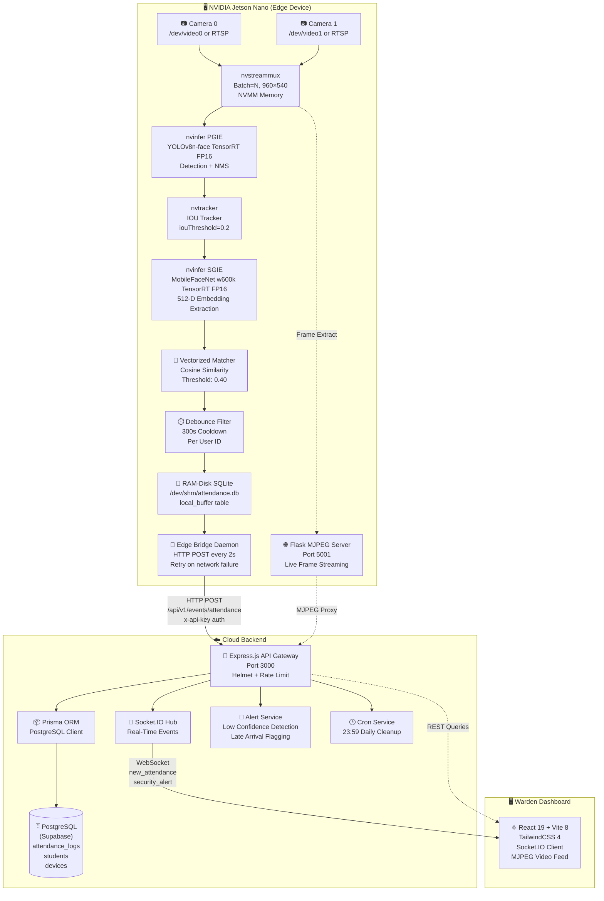

# 🎯 Real-Time Edge-to-Cloud Facial Recognition & Attendance System

> **Hardware-accelerated biometric attendance powered by NVIDIA DeepStream SDK, dual-stage TensorRT inference (YOLOv8 + MobileFaceNet/ArcFace), vectorized cosine-similarity matching, RAM-disk buffered local persistence, and an Express.js API gateway with Prisma ORM → PostgreSQL cloud synchronization.**

---

## Table of Contents

- [Executive Summary](#executive-summary)
- [Core Architectural Innovations](#core-architectural-innovations)
- [End-to-End Data Flow & Pipeline Architecture](#end-to-end-data-flow--pipeline-architecture)
- [Project Lifecycle & Methodology Milestones](#project-lifecycle--methodology-milestones)
- [Repository Structure](#repository-structure)
- [Technology Stack](#technology-stack)
- [Getting Started](#getting-started)
- [License](#license)

---

## Executive Summary

This system delivers **fully autonomous, real-time facial recognition and attendance logging** at the network edge using an NVIDIA Jetson Nano. The entire computer vision pipeline — from raw camera ingestion through face detection, identity verification, and attendance persistence — executes on-device with **zero cloud dependency for inference**.

### Key Engineering Differentiators

| Dimension | Implementation |
|---|---|
| **Inference Engine** | NVIDIA DeepStream 6.0 GStreamer pipeline with `pyds` Python bindings, bypassing the Python GIL entirely for GPU-accelerated frame processing |
| **Detection Model** | YOLOv8n-face (PGIE) — single-class face detector with custom YOLO NMS parser (`NvDsInferParseYolo`) compiled as `libnvds_infercustomparser_yolov8.so` |
| **Recognition Model** | MobileFaceNet w600k (SGIE) — 512-dimensional ArcFace embedding extractor, running at FP16 precision via TensorRT |
| **Matching Engine** | O(N) vectorized cosine similarity via NumPy matrix multiplication (`watchlist_matrix @ query_vector`) with a configurable threshold of `0.40` |
| **Object Tracking** | IOU Tracker (`libnvds_nvmultiobjecttracker.so`) with `iouThreshold=0.2` for persistent cross-frame identity assignment |
| **Debounce Logic** | 300-second (5-minute) cooldown per `user_id` preventing duplicate attendance records across continuous video frames |
| **Local Persistence** | Dual-layer: RAM-disk SQLite buffer (`/dev/shm/attendance.db`) for instant writes + CSV fallback log (`attendance.csv`) |
| **Cloud Sync** | Isolated `edge_bridge.py` daemon polling the RAM-disk buffer every 2 seconds, forwarding records via HTTP POST to the Express.js API gateway |
| **Backend** | Express.js v5 API gateway with Prisma ORM → PostgreSQL (Supabase), Redis-backed rate limiting, Socket.IO real-time push, and security alert interception |
| **Dashboard** | React 19 + Vite 8 + TailwindCSS 4 warden dashboard with live Socket.IO event streaming and MJPEG video proxy |

---

## Core Architectural Innovations

### 1. Hardware-Accelerated Optical Pipeline

The primary inference engine (`edge_daemon.py`) constructs a pure GStreamer pipeline that processes video frames entirely on the Jetson's GPU without Python GIL bottlenecks. The pipeline is built programmatically using GObject Introspection (`gi`) and NVIDIA's `pyds` bindings:

```
v4l2src/uridecodebin → nvvideoconvert → nvstreammux (batch=N, 960×540)
    → nvinfer [PGIE: YOLOv8n-face, FP16 TensorRT]
    → nvtracker [IOU Tracker, 640×640]
    → nvinfer [SGIE: MobileFaceNet w600k, FP16 TensorRT]
    → nvmultistreamtiler → nvvideoconvert → capsfilter (RGBA)
    → nvdsosd → nvegltransform → nveglglessink
```

**Critical design decisions derived from the codebase:**

- **Multi-source ingestion:** `create_source_bin()` (line 384) dynamically creates either `v4l2src` (USB/CSI cameras via device paths like `/dev/video0`) or `uridecodebin` (RTSP/HTTP streams). Each source is wrapped in a `Gst.Bin` with a ghost pad and linked to `nvstreammux` via indexed sink pads (`sink_0`, `sink_1`, etc.).
- **Batch-size auto-scaling:** The `nvstreammux` batch-size is set to `num_sources` (the count of CLI-provided camera URIs), enabling dynamic multi-camera scaling without config changes.
- **Frame extraction for streaming:** The probe callback (`osd_sink_pad_buffer_probe`, line 145) extracts raw RGBA frames from NVMM GPU memory via `pyds.get_nvds_buf_surface()`, converts them to BGR with OpenCV, and performs an **atomic write** (write to temp file, then `os.replace()`) to `/dev/shm/frame_{source_id}.jpg` — preventing read/write tearing when the Flask MJPEG server reads concurrently.
- **PGIE interval skip:** `interval=5` in `pgie_config.txt` means the detector only runs inference on every 5th frame, relying on the IOU tracker to maintain bounding boxes between detection cycles — a critical Jetson Nano power optimization.

### 2. Dual-Stage Biometric Engine & Multi-Angle Embedding Averaging

The system implements a **two-stage cascade** for face identification:

**Stage 1 — YOLOv8n-face (PGIE):**
- Config: `configs/pgie_config.txt`
- Single-class detector (`num-detected-classes=1`, label: `face`)
- Input normalization: `net-scale-factor=0.0039215697906911373` (i.e., `1/255`)
- NMS settings: `pre-cluster-threshold=0.15`, `nms-iou-threshold=0.45`, `topk=20`
- Minimum crop: `min-bbox-width=32`, `min-bbox-height=32`
- Custom bbox parser: `NvDsInferParseYolo` via compiled `.so` library

**Stage 2 — MobileFaceNet/ArcFace w600k (SGIE):**
- Config: `configs/sgie_config.txt`
- Operates exclusively on PGIE detections (`operate-on-gie-id=1`, `operate-on-class-ids=0`)
- ArcFace normalization: `(pixel - 127.5) / 128.0` via `net-scale-factor=0.0078125` and `offsets=127.5;127.5;127.5`
- Input dimensions: `3×112×112` with `symmetric-padding=1` and `maintain-aspect-ratio=1`
- `output-tensor-meta=1` — attaches raw embedding tensors to `NvDsObjectMeta` so Python can extract them via `ctypes`
- `batch-size=8` — handles up to 8 simultaneous face crops per batch cycle across all streams
- **Unique ID `2`** — the probe callback filters for `tensor_meta.unique_id != 2` to isolate SGIE outputs

**Multi-Angle Enrollment Averaging (`enroll_trt.py`):**

The enrollment script scans `image_db/<student_name>/` directories, processes 3-4 photos per subject, and produces a single **fused embedding**:

1. Each image is face-cropped using OpenCV's Haar cascade (`haarcascade_frontalface_default.xml`)
2. Cropped faces are preprocessed with **identical normalization** to the SGIE: symmetric letterbox padding to 112×112, BGR→RGB conversion, `(pixel - 127.5) / 128.0`
3. MobileFaceNet ONNX inference runs on CPU (`CPUExecutionProvider`) to avoid GPU contention
4. Each per-image embedding is L2-normalized individually
5. All embeddings for a student are **averaged** (`np.mean(embeddings, axis=0)`) and **re-normalized**
6. The resulting fused embedding is stored as a `BLOB` (raw FP32 bytes) in `attendance.db`
7. **Idempotency guarantee:** `has_embedding(student_name)` checks the DB before processing — existing students are completely skipped

### 3. Vectorized Face Matching Engine

The `match_face_vectorized()` function in `edge_daemon.py` (line 110) implements O(N) cosine similarity matching:

```python
# Pre-computed at startup:
watchlist_matrix = np.vstack([...])  # Shape: (N_enrolled, embedding_dim)
# Each row is already L2-normalized

# Per-detection (every SGIE output):
query = live_embedding / np.linalg.norm(live_embedding)  # L2-normalize
scores = watchlist_matrix @ query                          # Matrix-vector multiply
best_idx = np.argmax(scores)                               # O(N) argmax
best_score = scores[best_idx]

if best_score > SIMILARITY_THRESHOLD:  # 0.40
    return watchlist_names[best_idx], watchlist_ids[best_idx], best_score
```

**Dimension mismatch resilience:** If the live embedding dimension differs from the watchlist matrix (e.g., 512 vs 128), the code truncates both to `min_dim` and re-normalizes — gracefully handling model version mismatches without crashing.

**Track ID caching:** A `track_id_cache` dictionary maps IOU tracker object IDs to `(display_name, best_score, last_frame_seen)` tuples. Cache hits skip the SGIE embedding extraction entirely, providing near-zero latency for tracked faces. Stale entries are evicted every 100 frames if not seen for 150 frames.

### 4. Intelligent Debounce Engine & Zero-Data-Loss Architecture

**Debounce Logic (300-second cooldown):**

```python
COOLDOWN_SEC = 300  # 5 minutes

# In the probe callback:
if (uid not in last_logged or now - last_logged[uid] > COOLDOWN_SEC):
    save_to_buffer(uid, name, score, source_id)
    last_logged[uid] = now
```

This prevents the same individual from generating duplicate attendance entries within a 5-minute window — critical when a person stands in front of a camera for extended periods across hundreds of consecutive frames.

**Dual-Layer Persistence Architecture:**

```
┌─────────────────────────────────────────────────────────┐
│  edge_daemon.py (GStreamer Pipeline - System Python)     │
│                                                          │
│  Detection → Match → Debounce → save_to_buffer()        │
│                          │                               │
│                          ▼                               │
│            /dev/shm/attendance.db (RAM-disk SQLite)      │
│            └── local_buffer table                        │
│                 ├── student_id, student_name             │
│                 ├── timestamp, similarity_score           │
│                 └── camera_id                            │
└──────────────────────────┬──────────────────────────────┘
                           │ Polled every 2 seconds
                           ▼
┌─────────────────────────────────────────────────────────┐
│  edge_bridge.py (Isolated Sync Daemon)                   │
│                                                          │
│  1. SELECT * FROM local_buffer                           │
│  2. HTTP POST to backend API (per record)                │
│  3. On 2xx → DELETE FROM local_buffer WHERE id = ?       │
│  4. On 4xx → DELETE (prevent queue block)                │
│  5. On network error → LEAVE in DB, retry next cycle     │
└─────────────────────────────────────────────────────────┘
```

**Network resilience guarantees:**
- Records are **never deleted** from the SQLite buffer until the backend confirms successful receipt (HTTP 2xx) or definitively rejects the payload (HTTP 4xx)
- Network errors (`requests.exceptions.RequestException`) cause the record to remain in the buffer for the next sync cycle
- The SQLite connection uses `timeout=5.0` to prevent database lock crashes when `edge_daemon.py` writes and `edge_bridge.py` reads simultaneously
- The RAM-disk path (`/dev/shm/`) provides microsecond write latency with zero SD card wear

### 5. Cloud Backend — Express.js API Gateway

The `attendance-express-backend/` implements a production-grade Node.js API gateway:

**Architecture Layers:**
1. **Security:** Helmet.js headers + API key authentication (`x-api-key` middleware)
2. **Rate Limiting:** Redis-backed sliding window (`express-rate-limit` + `ioredis`) — 1000 requests per 15-minute window
3. **Structured Logging:** Pino + pino-http for JSON-structured request/response logging
4. **ORM:** Prisma Client with PostgreSQL (Supabase) — handles `attendance_logs`, `students`, and `devices` tables
5. **Real-Time Push:** Socket.IO hub emits `new_attendance` and `security_alert` events to all connected dashboard clients
6. **Security Interceptor:** `AlertService` flags low-confidence matches (`similarity_score < 0.60`) and late arrivals (between 09:00–15:00)
7. **Cron:** End-of-day cleanup job at 23:59 for memory cache management
8. **MJPEG Proxy:** Proxies live video feeds from the Jetson's Flask server (`edge_server.py:5001`) through to the dashboard

**REST API Surface:**

| Method | Endpoint | Auth | Description |
|---|---|---|---|
| `POST` | `/api/v1/events/attendance` | `x-api-key` | Ingest attendance record from edge device |
| `GET` | `/api/v1/events/attendance/today` | Public | Fetch today's attendance records |
| `GET` | `/api/v1/events/feed/:camera_id` | Public | Proxy MJPEG live feed from Jetson |
| `POST` | `/api/v1/students` | Public | Register a new student |
| `GET` | `/api/v1/students` | Public | List all students |
| `POST` | `/api/v1/students/enroll-biometric` | Public | Trigger remote face enrollment on Jetson |
| `POST` | `/api/v1/devices` | Public | Register a camera device (IN/OUT role) |
| `GET` | `/api/v1/devices` | Public | List all registered devices |
| `DELETE` | `/api/v1/devices/:id` | Public | Delete a device and its associated logs |
| `GET` | `/api/v1/analytics/today` | Public | Daily statistics (walk-throughs, unique students, alerts) |
| `GET` | `/health` | Public | Health check with uptime |

---

## End-to-End Data Flow & Pipeline Architecture



### Layer-by-Layer Operational Breakdown

| Layer | Component | Responsibility |
|---|---|---|
| **L1 — Ingestion** | `v4l2src` / `uridecodebin` | Captures raw frames from USB, CSI, or RTSP sources |
| **L2 — Muxing** | `nvstreammux` | Batches frames from multiple sources into a single GPU tensor batch |
| **L3 — Detection** | `nvinfer` (PGIE) | YOLOv8n-face runs TensorRT FP16 inference, outputs face bounding boxes |
| **L4 — Tracking** | `nvtracker` (IOU) | Maintains persistent object IDs across frames without re-detection |
| **L5 — Embedding** | `nvinfer` (SGIE) | MobileFaceNet extracts 512-D ArcFace embeddings from cropped face regions |
| **L6 — Matching** | `match_face_vectorized()` | Vectorized cosine similarity against pre-loaded watchlist matrix |
| **L7 — Debounce** | `last_logged` dict + `COOLDOWN_SEC` | Suppresses duplicate records within 300-second windows |
| **L8 — Buffer** | SQLite on `/dev/shm/` | Microsecond-latency local persistence on RAM disk |
| **L9 — Sync** | `edge_bridge.py` daemon | Polled HTTP sync with delete-on-success semantics |
| **L10 — API** | Express.js + Prisma | Validates, persists to PostgreSQL, triggers alerts, emits Socket.IO events |
| **L11 — Dashboard** | React + Socket.IO | Real-time attendance feed, MJPEG video, analytics |

---

## Project Lifecycle & Methodology Milestones

### Milestone 1: Architecture & Pipeline Design

- Scoped the GStreamer pipeline topology for multi-camera simultaneous ingestion via `nvstreammux`
- Designed the source bin abstraction (`create_source_bin()`) supporting both `v4l2src` (USB/CSI) and `uridecodebin` (RTSP/HTTP) with unified ghost pad linkage
- Allocated NVMM buffer memory strategy: `nvbuf-memory-type=0` (device default), resolution capped at 960×540 to balance quality and Tegra throughput
- Established the PGIE→Tracker→SGIE cascade order with unique GIE IDs for tensor metadata isolation

### Milestone 2: Data & Embedding Curation

- Designed the `image_db/<student_name>/` directory structure supporting 3-4 multi-angle photographs per subject
- Developed `enroll_trt.py` with **idempotent enrollment**: `has_embedding()` check prevents re-processing of existing subjects
- Implemented DeepStream-equivalent preprocessing in the offline enrollment script: symmetric letterbox padding, identical normalization formula `(pixel - 127.5) / 128.0`, BGR→RGB color space conversion
- Verified embedding alignment between offline ONNX inference and live TensorRT SGIE output via norm and dimension logging

### Milestone 3: Edge Model Optimization

- Converted YOLOv8n-face from PyTorch (`.pt`) → ONNX (opset 11, fixed 640×640) via `fix_onnx.py` using Ultralytics export
- Converted MobileFaceNet from static-batch ONNX to dynamic-batch ONNX via `fix_mbf_batch.py` (modifying `dim_param` on input/output nodes)
- TensorRT auto-builds FP16 engines on first run: `yolov8n-face.onnx_b2_gpu0_fp16.engine` and `w600k_mbf_dynamic.onnx_b8_gpu0_fp16.engine`
- Compiled custom YOLO NMS parser (`NvDsInferParseYolo`) as a shared library: `libnvds_infercustomparser_yolov8.so`

### Milestone 4: Resilience & Verification

- Implemented 300-second cooldown debounce preventing database spam from continuous face presence
- Designed the RAM-disk SQLite buffer (`/dev/shm/attendance.db`) decoupling inference speed from network availability
- Built the `edge_bridge.py` sync daemon with retry semantics: records survive network outages, deleted only on HTTP 2xx confirmation
- Validated track ID cache eviction (every 100 frames, 150-frame staleness threshold) to prevent unbounded memory growth
- Atomic frame writes (`os.replace()`) prevent MJPEG read/write tearing

### Milestone 5: Cloud Synchronization & Deployment

- Built Express.js v5 API gateway with layered middleware: Helmet → CORS → JSON parser → Pino logging → Redis rate limiting
- Defined Prisma schema with `AttendanceLog`, `Student`, and `Device` models mapped to PostgreSQL tables
- Implemented `AlertService` security interceptor for low-confidence detections and late arrivals
- Integrated Socket.IO for real-time dashboard event push (`new_attendance`, `security_alert`)
- Dockerized backend with Node 20 Alpine image and Prisma client generation
- Built React 19 + Vite 8 warden dashboard with TailwindCSS 4, framer-motion animations, and Socket.IO client integration

---

## Repository Structure

```
FACE_Detection_Jetson/
│
├── 🧠 EDGE INFERENCE ENGINE
│   ├── edge_daemon.py              # Main DeepStream GStreamer pipeline & face matching engine
│   ├── db_utils.py                 # SQLite ORM: embeddings storage, loading, attendance logging
│   ├── edge_bridge.py              # Isolated network sync daemon (HTTP POST to backend)
│   ├── edge_server.py              # Flask MJPEG streaming server (port 5001)
│   ├── cloud_utils.py              # Legacy direct-HTTP cloud logger (background thread queue)
│   │
│   ├── configs/
│   │   ├── pgie_config.txt         # YOLOv8n-face PGIE: TensorRT FP16, custom NMS parser
│   │   ├── sgie_config.txt         # MobileFaceNet SGIE: ArcFace embedding, output-tensor-meta
│   │   └── tracker_config.yml      # IOU Tracker: threshold=0.2, maxTargets=20
│   │
│   ├── labels.txt                  # Single-class label file: "face"
│   ├── attendance.csv              # Local CSV backup log (name, date, time)
│   └── log.txt                     # Runtime diagnostic logs
│
├── 🎓 ENROLLMENT PIPELINE
│   ├── enroll_trt.py               # Auto-enrollment: multi-angle averaging + idempotency
│   ├── fix_onnx.py                 # YOLOv8 PyTorch → ONNX export (opset 11, fixed batch)
│   ├── fix_mbf_batch.py            # MobileFaceNet ONNX static → dynamic batch conversion
│   │
│   └── image_db/                   # Face photo database (3-4 images per subject)
│       ├── Aniket/
│       ├── Raj/
│       ├── aditya/
│       └── sharad/
│
├── 🔧 TESTING & DIAGNOSTICS
│   └── test_fps_no_model.py        # Raw camera FPS benchmark (pipeline without AI models)
│
├── ☁️ CLOUD BACKEND (attendance-express-backend/)
│   ├── src/
│   │   ├── app.js                  # Express.js v5 entry point, middleware stack, route mounting
│   │   ├── controllers/
│   │   │   ├── event.controller.js     # Attendance ingestion, today's logs, MJPEG proxy
│   │   │   ├── student.controller.js   # Student CRUD + remote biometric enrollment trigger
│   │   │   ├── device.controller.js    # Camera device registration (IN/OUT roles)
│   │   │   └── analytics.controller.js # Daily statistics (walk-throughs, alerts, unique students)
│   │   ├── services/
│   │   │   ├── event.service.js        # Prisma DB insertion + device role lookup for direction
│   │   │   ├── socket.service.js       # Socket.IO initialization and event emission
│   │   │   ├── alert.service.js        # Security interceptor (low confidence, late arrival)
│   │   │   └── cron.service.js         # End-of-day cleanup job (23:59 daily)
│   │   ├── middlewares/
│   │   │   ├── auth.middleware.js       # x-api-key header validation
│   │   │   ├── rate-limit.js           # Redis-backed sliding window rate limiter
│   │   │   └── error.middleware.js     # Global error handler
│   │   ├── routes/
│   │   │   ├── event.routes.js
│   │   │   ├── student.routes.js
│   │   │   ├── device.routes.js
│   │   │   └── analytics.routes.js
│   │   └── utils/
│   │       └── logger.js               # Pino structured logger
│   ├── prisma/
│   │   └── schema.prisma               # Database schema: AttendanceLog, Student, Device
│   ├── Dockerfile                      # Node 20 Alpine + Prisma client generation
│   └── package.json
│
├── 🖥️ WARDEN DASHBOARD (warden-dashboard/)
│   ├── src/
│   │   ├── App.tsx                     # React 19 application root
│   │   ├── main.tsx                    # Vite entry point
│   │   ├── socket.ts                   # Socket.IO client configuration
│   │   ├── types.ts                    # TypeScript type definitions
│   │   ├── pages/                      # Page-level React components
│   │   ├── components/                 # Reusable UI components
│   │   ├── index.css                   # TailwindCSS 4 styles
│   │   └── style.css                   # Additional global styles
│   ├── Dockerfile                      # Vite build + Nginx static serving
│   ├── nginx.conf                      # Nginx reverse proxy config
│   ├── vite.config.ts
│   ├── tsconfig.json
│   └── package.json
│
├── .gitignore
├── SETUP_GUIDE.md                      # Deployment & installation manual
└── README.md                           # This file
```

---

## Technology Stack

### Edge Device

| Component | Technology | Version / Details |
|---|---|---|
| Hardware | NVIDIA Jetson Nano (4GB) | Tegra X1, 128 CUDA cores, 4 ARM Cortex-A57 |
| OS/Firmware | NVIDIA JetPack | 4.6.1 (L4T R32.7.1) |
| Vision SDK | NVIDIA DeepStream | 6.0.1 |
| Inference | TensorRT | 8.x (FP16 precision) |
| GPU Compute | CUDA / cuDNN | 10.2 / 8.2 |
| Detection | YOLOv8n-face | Custom ONNX, single-class, opset 11 |
| Recognition | MobileFaceNet (ArcFace w600k) | 512-D embeddings, dynamic batch ONNX |
| Runtime | Python 3.6+ (System) | GStreamer + pyds bindings |
| Enrollment | Python 3.6+ (venv) | onnxruntime, OpenCV, NumPy |
| Local DB | SQLite 3 | RAM-disk (`/dev/shm/`) |
| Streaming | Flask + CORS | MJPEG multipart HTTP |

### Cloud Backend

| Component | Technology | Version |
|---|---|---|
| Runtime | Node.js | 20 (Alpine Docker) |
| Framework | Express.js | 5.x |
| ORM | Prisma Client | 6.x |
| Database | PostgreSQL (Supabase) | 15+ |
| Caching | Redis (ioredis) | 5.x |
| Real-Time | Socket.IO | 4.x |
| Security | Helmet + express-rate-limit | Latest |
| Logging | Pino + pino-http | 10.x |
| Scheduling | node-cron | 4.x |

### Frontend Dashboard

| Component | Technology | Version |
|---|---|---|
| Framework | React | 19.x |
| Bundler | Vite | 8.x |
| Styling | TailwindCSS | 4.x |
| Animation | Framer Motion | 12.x |
| Icons | Lucide React | 1.x |
| Routing | React Router DOM | 7.x |
| Real-Time | socket.io-client | 4.x |
| HTTP | Axios | 1.x |

---

## Getting Started

For complete deployment instructions, see **[SETUP_GUIDE.md](SETUP_GUIDE.md)**.

### Quick Start Overview

1. **Enroll faces** (in Python virtual environment):
   ```bash
   source venv/bin/activate
   python3 enroll_trt.py
   deactivate
   ```

2. **Launch inference** (System Python — no venv):
   ```bash
   python3 edge_daemon.py /dev/video0
   ```

3. **Start sync daemon** (separate terminal):
   ```bash
   python3 edge_bridge.py
   ```

4. **Start edge MJPEG server** (separate terminal):
   ```bash
   python3 edge_server.py
   ```

5. **Start backend API** (on cloud server):
   ```bash
   cd attendance-express-backend && npm install && npx prisma generate && npm start
   ```

---

## License

This project is developed as part of an academic thesis / engineering capstone. All rights reserved by the authors.
